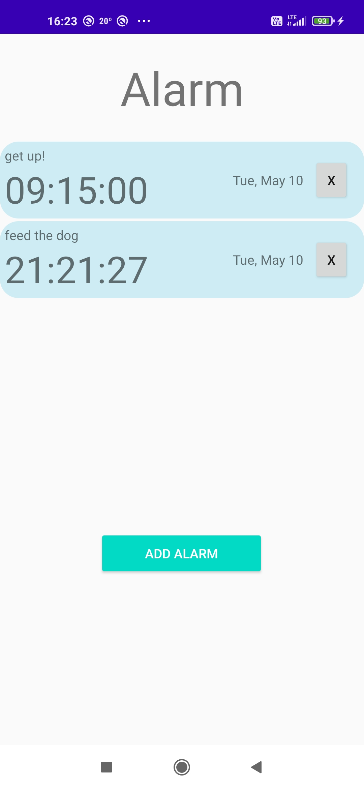
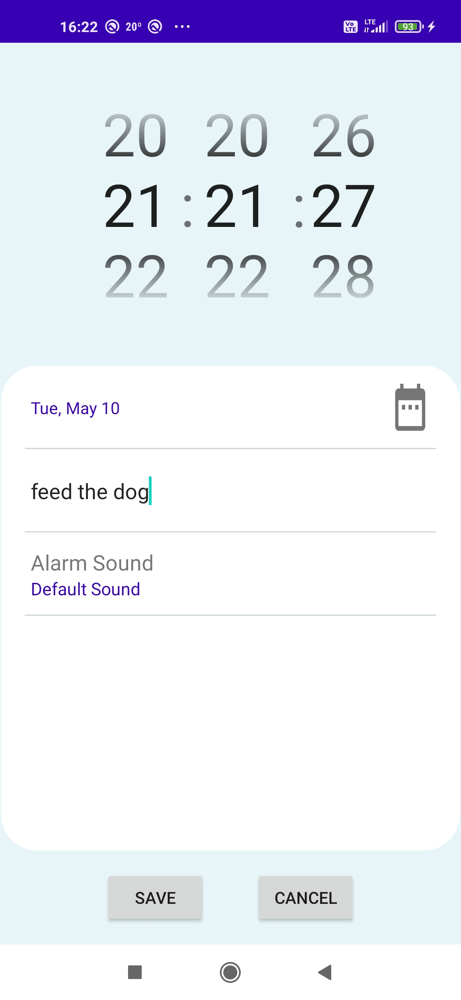
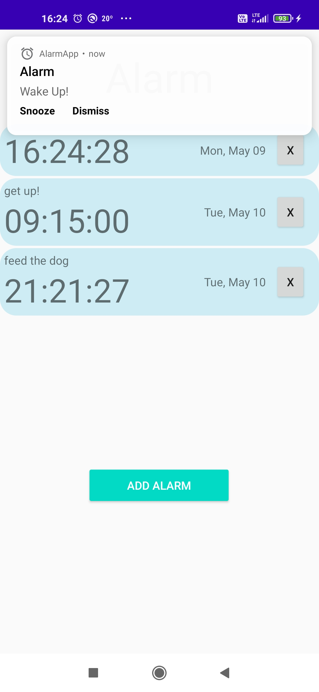
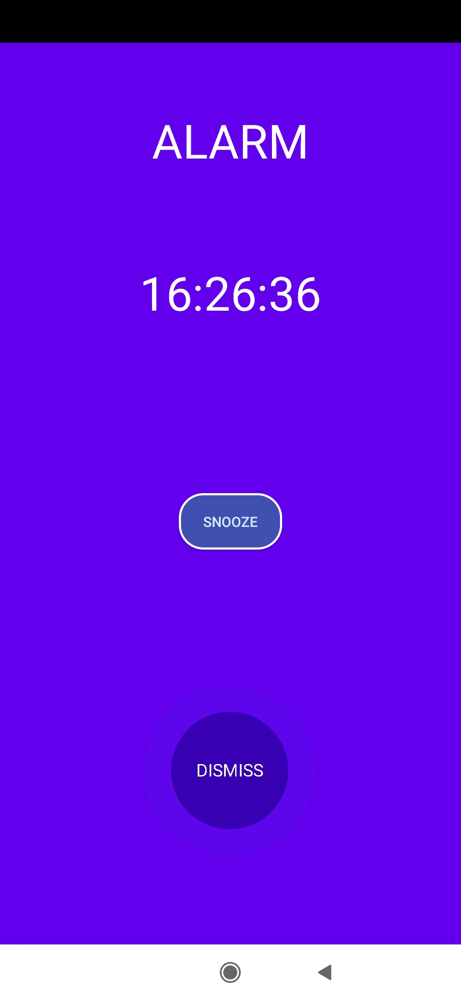

# AlarmApp
AlarmApp is a simple android alarm application showing MVVM architecture.
This app allows user to set multiple alarms, update and delete them. You can snooze or dismiss alarm by clicking
or swiping. You can also set a description for the alarm and select alarm sound.

#### Technologies used

   * Data Binding Library
   * LiveData
   * Room
   * RxJava

    